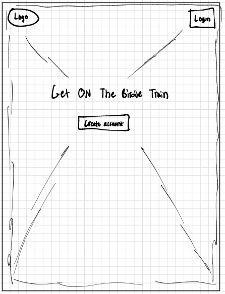
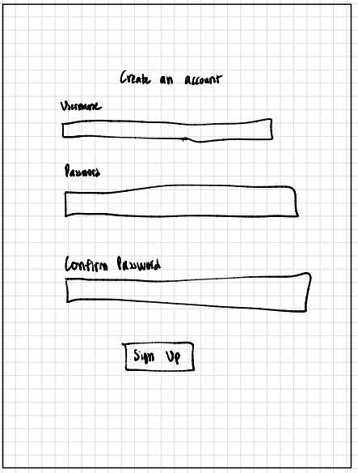
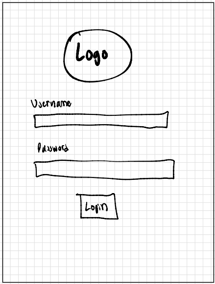
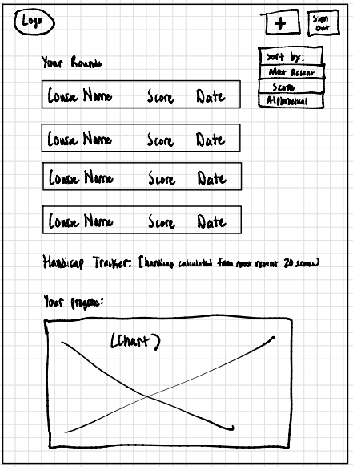
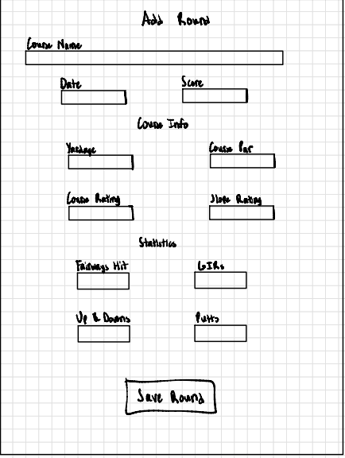
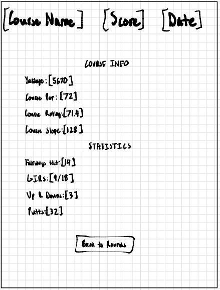
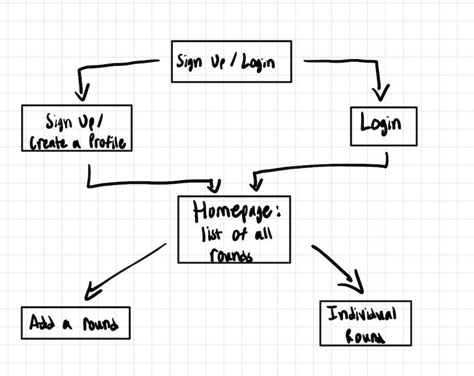

# Birdie Train

## Overview

Attention all golfers! Do you want to improve your golf game but don't know where to start? That's where Birdie Train comes in!

Birdie Train is a web app that allows users to keep track of their golf stats for each round. Users can register and login. Once they're logged in, they can add a new round or view all of their previous rounds. For every round that they have, they can keep important statistics such as their score, the number of fairways or putts they've hit, and the course rating.

## Data Model
The application will store Users, Rounds, and Stats

- users can have multiple rounds (via references)
- each round can have multiple stats (by embedding)

An Example User:

```javascript
{
  username: "numberOneGolfer",
  hash: "<hashed_password>",// a password hash,
  rounds: ["<ObjectId of Round 1>", "<ObjectId of Round 2>"] // an array of references to Round documents
}
```

An Example Round with Embedded Items:

```javascript
{
  "user": "<ObjectId of numberOneGolfer>",
  "courseName": "Watters Creek Golf Course",
  "date": "2024-10-15",
  "score": 78,
  "yardage": 5800,
  "courseInfo": {
    "coursePar": 72,
    "courseRating": 71.5,
    "slopeRating": 125
  },
  "roundStats": {
    "fairways": 10,
    "GIRs": 12,
    "upAndDowns": 5,
    "putts": 30
  }
  createdAt: // timestamp
}
```

## [Link to Commented First Draft Schema](src/db.mjs)

## Wireframes

/ - initial page



/signup - user signup page



/login - user login page



/home - homepage showing list of all user rounds



/addRound - page for creating a new round



/home/slug - page for showing specific round



## Site map



## User Stories

1. as non-registered user, I can register a new account with the site
2. as a user, I can log in to the site
3. as a user, I can add a new golf round
4. as a user, I can view all of the rounds I've played in a single list
5. as a user, I can update any statistics to an existing round
6. as a user, I can delete any round from my list

## Research Topics

- (6 points) React
  - I will use React as the main frontend framework to build the golf stats management system. React will manage the user interface and help create interactivity in the app. 
  - see <code>/src/App.js</code> for the main React setup and structure
- (2 points) Tailwind CSS
  - I am using Tailwind CSS to style the application to give it a responsive design. Tailwind will help speed up development by providing utility classes directly in JSX without needing custom CSS files. 
  - see <code>/src/App.css</code> for Tailwind setup and custom styling
- (2 points) Client-Side Javascript Library: Chart.js
  - I'll use Chart.js to visualize user golf stats over time, including graphs for scores, averages, and trends. This will enhance the user experience by adding a visual component to the interface. 
- (2 points) Client-Side Javascript Library: React Hook Form
  - I'll use React Hook Form to manage form state and validation, especially for adding new rounds and updating stats. This will make form handling more efficient and improve user interaction with the app

12 points total out of 10 required points 

## [Link to Initial Main Project File](src/app.mjs)

## Annotations / References Used

1. [react.js docs](https://react.dev/learn) - 
2. [tailwindcss docs](https://v2.tailwindcss.com/docs) -
3. [chart.js docs](https://www.chartjs.org/docs/latest/)
4. [react hook form docs](https://react-hook-form.com/get-started)
